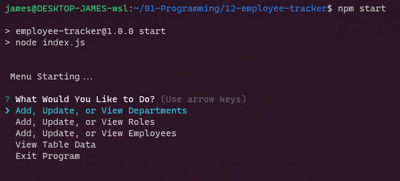
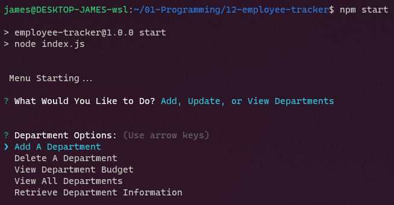
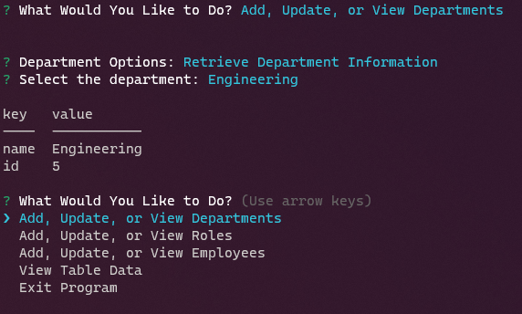
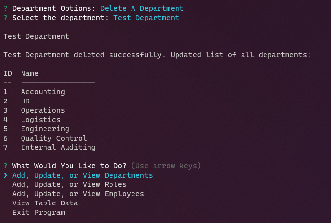
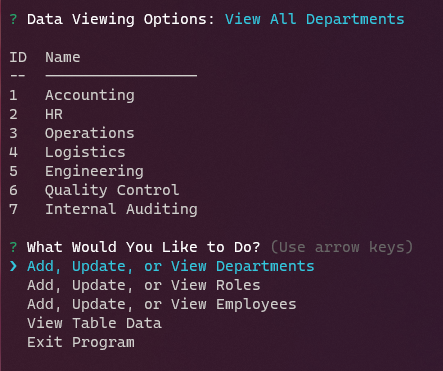
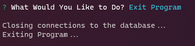
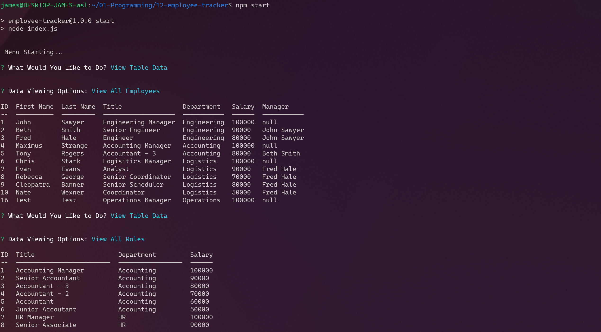

# Sql Employee Database

## Description

Uses an SQL database to maintain and organize its employee across various departments. SQL Database has 3 tables, employees, roles, and departments. The employees are assigned roles from the roles department and assigned managers from within the same employees table. Roles is assigned a department from the departments table. Together, these 3 tables provide the backbone for an employee information system. 

**User Story**
```
AS A business owner
I WANT to be able to view and manage the departments, roles, and employees in my company
SO THAT I can organize and plan my business
```

**Acceptance Criteria**
```
GIVEN a command-line application that accepts user 
WHEN I start the application
THEN I am presented with the following options: view all departments, view all roles, view all employees, add a department, add a role, add an employee, and update an employee role
WHEN I choose to view all departments
THEN I am presented with a formatted table showing department names and department ids
WHEN I choose to view all roles
THEN I am presented with the job title, role id, the department that role belongs to, and the salary for that role
WHEN I choose to view all employees
THEN I am presented with a formatted table showing employee data, including employee ids, first names, last names, job titles, departments, salaries, and managers that the employees report to
WHEN I choose to add a department
THEN I am prompted to enter the name of the department and that department is added to the database
WHEN I choose to add a role
THEN I am prompted to enter the name, salary, and department for the role and that role is added to the database
WHEN I choose to add an employee
THEN I am prompted to enter the employee’s first name, last name, role, and manager, and that employee is added to the database
WHEN I choose to update an employee role
THEN I am prompted to select an employee to update and their new role and this information is updated in the database
```

Using mysql2 turned out to be a larger challenge than expected due to how the inputs are parameterized. For values and tables, this usually wasn't an issue. For column names though, I would regularly experience errors since the column names being inserted into the query were wrapped with single quotes. As such, I could not rely on previous classes and methods I had built to autogenerate sql queries. Instead, most of them had to be manually created extending the completion time for this project.

## Table of Contents

1. [Installation](#installation)
2. [Usage](#usage)
3. [License](#license)
4. [Contribute](#contribute)
5. [Tests](#tests)
6. [Questions](#questions)


## Installation

Git Clone this repository onto your local machine. Navigate to the downloaded project location. Open a command-line terminal in the same directory and run `npm install`. If you do not have nodejs and npm installed, you must install those first before running `npm install`. After npm install completes, you are ready to run the program.

## Usage

From the command line, run `npm start`. A list of actions will appear for you to choose from. Select the action and follow the prompts. After completing a full set of prompts, you will be returned to the main menu. You may select `Exit Program` to quit the application. If you need to quit in the middle of a prompt, press `CTRL + C` on your keyboard.

See the pictures below for a quick run through:

Start Menu:


Department Menu:


Add Department:


Get Department:


Delete Department:


View All Departments:


Exit:


For a more in-depth video walkthrough, please watch the video below.
[](https://drive.google.com/file/d/1sgbuRan7rUIRgHa-JLb7lnjbKyv5KNO-/view "SQL Employee Database Video Guide")
[View on Youtube](https://youtu.be/zW7h3B6npLo "SQL Employee Database Video Guide")

## License


MIT

Copyright (c) 2022 James Perry

Permission is hereby granted, free of charge, to any person obtaining a copy of this software and associated documentation files (the "Software"), to deal in the Software without restriction, including without limitation the rights to use, copy, modify, merge, publish, distribute, sublicense, and/or sell copies of the Software, and to permit persons to whom the Software is furnished to do so, subject to the following conditions:

The above copyright notice and this permission notice shall be included in all copies or substantial portions of the Software.

THE SOFTWARE IS PROVIDED "AS IS", WITHOUT WARRANTY OF ANY KIND, EXPRESS OR IMPLIED, INCLUDING BUT NOT LIMITED TO THE WARRANTIES OF MERCHANTABILITY, FITNESS FOR A PARTICULAR PURPOSE AND NONINFRINGEMENT. IN NO EVENT SHALL THE AUTHORS OR COPYRIGHT HOLDERS BE LIABLE FOR ANY CLAIM, DAMAGES OR OTHER LIABILITY, WHETHER IN AN ACTION OF CONTRACT, TORT OR OTHERWISE, ARISING FROM, OUT OF OR IN CONNECTION WITH THE SOFTWARE OR THE USE OR OTHER DEALINGS IN THE SOFTWARE.

## How to Contribute

Before contributing, be sure to read the GitHub [Code of Conduct](https://github.com/github/docs/blob/main/CODE_OF_CONDUCT.md). If you have an issue, search all open issues to see if one matches the description of your issue. If not, proceed to create one providing details on the issue, errors, OS, options provided, installed node packages, etc. Issues are not assigned to anyone by the repository team. To select an issue to work on, open a pull request and generate a new branch labeled as the issue. Add your name as a contributor to the issue in question. When you make the desired changes and fixes, push all changes to your branch on the repository and submit. The repository team will review the changes. If acceptable, we will merge the changes to main and we will notify you of a successful merge or any necessary changes before a merge can take place.

## Tests

No Tests Provided

## Questions

Repo owner: [pbp66](https://github.com/pbp66).
For any questions, you may contact pbp66 via email: perryjames00@gmail.com. Please format your email using the following template:

- Subject: Repository - Question/Issue
- Body: Summarize the issue with a brief description for the first paragraph. Additional paragraphs can be used for a long description, if needed. Include any errors when using this project
- Signature: Please leave an email address so that any updates are sent get back to you.

